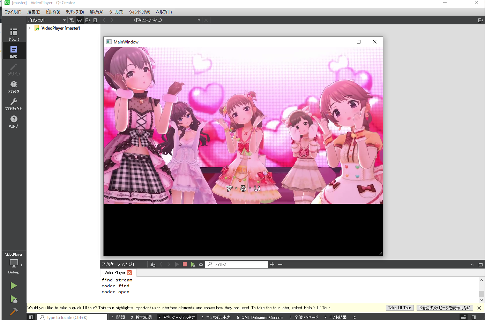

# VideoPlayer 　　

windows向けビデオプレイヤー(映像のみ)  

これはQtプロジェクトです。  
QtCreaterで開くことができます。  
  
  
FFMPEGのバージョンは、4.3です。  
Qtのバージョンは、5.15です。  
c++のバージョンは、c++11です。  

____________
## ブランチの分け方
[0.0.0]ffnpeg,qtの導入  
[0.1.0]ffmpegで動画ファイル(mp4)から画像ファイル(ppm)の抽出  
[0.2.0]ffmpegで動画ファイルの映像再生。  

  
   
コードの説明は以下を見てください。  
https://nakadasanda.hatenablog.jp/entry/2020/07/03/105404  

Qtの開発環境の構築については、以下を参照してください。   
https://nakadasanda.hatenablog.jp/entry/2020/06/22/223846  

ビデオプレイヤー作成に関しては、以下のサイトを見てください。  
https://nakadasanda.hatenablog.jp/archive/category/%E3%82%AA%E3%83%BC%E3%83%87%E3%82%A3%E3%82%AA%E3%81%A8%E3%83%93%E3%83%87%E3%82%AA%E3%82%92%E3%82%8B%E6%94%AF%E3%81%88%E3%82%8B%E6%8A%80%E8%A1%93  

